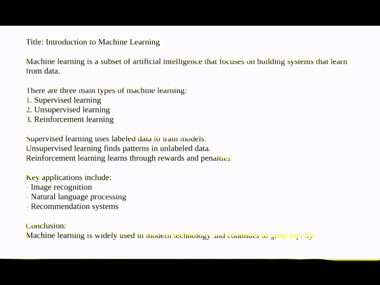

# PDF Chat

A lightweight RAG (Retrieval-Augmented Generation) application for chatting with PDF documents using OpenAI models and Streamlit.

---

## Features

* **Upload multiple PDF files**
* **Automatic document indexing (vector search)**
* **Conversational interface with memory**
* **Context-aware answers based on document content**
* **OCR fallback for scanned PDFs (Tesseract)**
* **Streaming responses (token-by-token)**
* **Configurable via environment variables**
---

## Architecture

```
PDFs
  |
  ▼
Loader
  │
  ▼
(OCR fallback)
  │
  ▼
Chunking
  │
  ▼
Embeddings
  │
  ▼
Vector Index
  │
  ▼
Chat Engine
  │
  ▼
Streamlit UI
```

### Components

| Component    | Responsibility                                      |
| ------------ | --------------------------------------------------- |
| `Engine`     | ingestion, indexing, querying                       |
| `PDFChat`    | Streamlit UI layer                                  |
| `Settings`   | environment-driven configuration                    |
| `Logger`     | optional debug logging                              |

---

## Tech Stack

* **Python**
* **Streamlit**
* **LlamaIndex**
* **OpenAI API**
* **Tesseract OCR**
* **pdf2image**
* **Pydantic (config validation)**

---

## Installation

Clone the repository:
```bash
git clone https://github.com/mzivro/pdf-chat.git
cd pdf-chat
```

Create a virtual environment:
```bash
python -m venv venv
source venv/bin/activate  # Linux / MacOS
venv\Scripts\activate     # Windows
```

Install dependencies:
```bash
pip install -r requirements.txt
```

### Environment Variables

Create a `.env` file in root folder:

```
OPENAI_API_KEY=your_api_key_here
OPENAI_MODEL=gpt-4.1-mini

CHUNK_SIZE=512
CHUNK_OVERLAP=50
MEMORY_TOKEN_LIMIT=3000
MAX_OCR_PAGES=10
EMBED_BATCH_SIZE=64

DEBUG=False
```

---

## Usage

```bash
streamlit run src/app.py
```

### Workflow

1. Upload PDF files
2. Click "Ingest data"
3. Ask questions in chat


### Example queries

* "Summarize this document"
* "What are the key findings?"
* "Explain section 3 in simple terms"

---

## How It Works
### 1. Ingestion
* PDFs are parsed using PDFReader
* If text extraction fails -> OCR is applied

### 2. Processing
* Text is split into chunks (SentenceSplitter)
* Embeddings are generated (OpenAI)

### 3. Indexing
* Stored in a vector index (VectorStoreIndex)

### 4. Querying
* Chat engine retrieves relevant context
* Response is generated using LLM + memory buffer

---

## Limitations

* OCR quality depends on Tesseract accuracy
* Large PDFs may increase processing time
* No persistence layer (index resets on restart)

---

## Possible Future Improvements

* Persistent vector database (e.g. FAISS, Chroma)
* Better OCR preprocessing
* More advanced retrieval strategies (like reranking, hybrid search etc.)

---

## Demo



---

## License

MIT License. Feel free to use, modify, and build upon this project.
